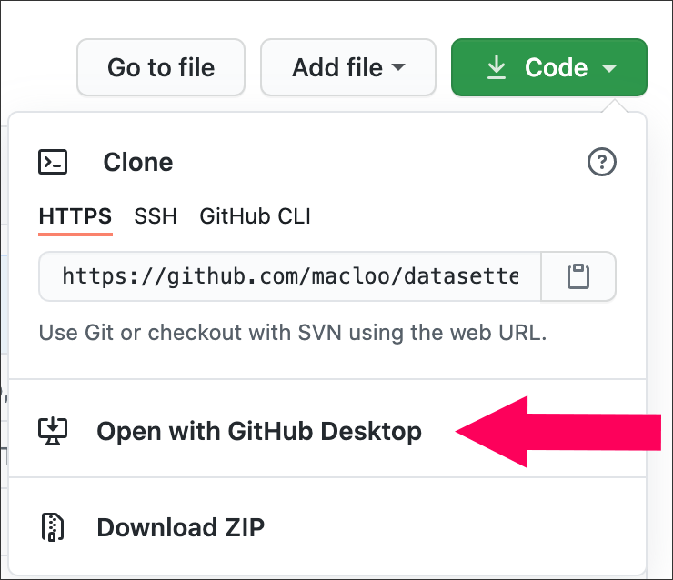

# Forking and Cloning with GitHub

Before you read this, please make sure you are familiar with the [basics of GitHub](../github_basics).

## Forking a repo

This is how you make a copy of someone else’s repo for yourself. Make sure you're *signed in* at GitHub first.

A repo can contain lots of files and folders, or few, or none (that would be an empty repo). Each GitHub user can have unlimited repos. As many as you want.

### Why do we fork?

To get a complete copy of a repo that we can work with, edit, or add to &mdash; and then, usually, contribute back to, with a pull request.

### When should you just download instead?

If you don't intend to contribute to a repo, there’s no need to fork it. Just download a zipped copy using the “Code” button on the repo’s page at GitHub.

*From the “Code” button’s menu, you can either fork the repo &mdash; “Open with GitHub Desktop,” &mdash; or download a zipped folder &mdash; “Download ZIP.”*

### How to fork

Find the button that says “Fork” near the top of the page, right side, at GitHub.com. WAIT BEFORE YOU CLICK IT. This makes a new, independent copy of the entire repo under YOUR GitHub username. You will have your own copy. As soon as you click “Fork,” you'll be *on YOUR COPY.* Look at the URL in the browser address bar, and you’ll see **your own username** there.

**Fork:** Your repo (the forked copy) will not be changed when the original owner changes the original. Likewise, you can *change* your copy, and it will not affect the original. In most cases, you will only fork ONCE for one repo. (There is a way to update so that yours matches any changes made to the original, but let’s leave that aside for now.)

The original URL:

The new URL will contain your username:

**After forking:** The repo does not exist on your computer YET.

Only FORK a repo ONCE. After you have forked it, it exists as a repo on YOUR GitHub.com site, online.

## Cloning a repo

**NOTE:** Before you CLONE a repo, *make sure* you are on YOUR own personal GitHub.com site.​ DO NOT clone it from my GitHub, where the URL includes “macloo.” Clone it from *your own* GitHub, where the URL includes YOUR NAME.

### Step 1

Find the button that says “**Code**” and click it.

Then click the black text “Open with GitHub Desktop.” Your GitHub Desktop app should already be open.

**IMPORTANT NOTE:** Where it says “https://github.com/macloo/datasette” in my screenshot below &mdash; yours will say “https://github.com/yourname/CSS-and-GitHub-intro” instead. DO NOT CHANGE THIS.

### Step 2

The image below shows ME (macloo) cloning a repo that I forked from another person. Where it says “https://github.com/macloo/datasette” &mdash; yours will say “https://github.com/yourname/name-of-some-repo” instead. DO NOT CHANGE THIS.

Where it says “Local Path,” that’s where the repo will be on YOUR COMPUTER. Use the **Choose ...** button to put it exactly where you want it to be. TAKE YOUR TIME with this step and be sure you know where it’s going!

Finally, after that, click the **Clone** button.

### Step 3

In the popup seen below, click “For my own purposes” and then click the **Continue** button.

If you get an error message, double-check that you have followed the steps above correctly.

**Clone** uses your app (GitHub Desktop) to make a copy of the entire repo **on your hard drive,** and this copy is tethered to the version on the GitHub.com site (as you will see). You *might* clone a repo more than once, in some circumstances. But usually ONCE is enough.

## What you should have now

You have the exact same repo &mdash; all the files &mdash;  BOTH on your GitHub online AND locally on your own computer.

At GitHub.com, when you go to your user page/profile, you’ll see a link to your new repo (click it to view the repo). If you were on the **Repositories** tab, you'll need to **reload** the page to see the new repo.

On your hard drive, you’ll see a folder with the *same name* as that repo. *Do not change the name!* (These two are tethered together, thanks to Git.) Where is that folder? It is where you told it to be saved, when you cloned it.

You could now edit files in the repo on your computer &mdash; *but wait!* If you intend to contribute back to the original, you’ll need to create a **branch** first.

Next: [Git Branches](../git_branches)
