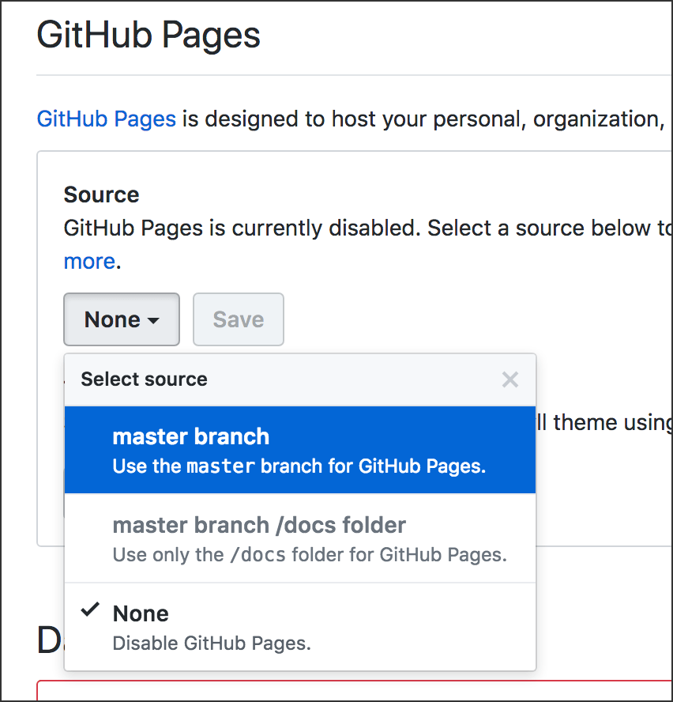

# gh-pages &mdash; Free Websites from GitHub

Previous: [Git Branches](../git_branches)

There’s a particular type of **branch** at GitHub that enables you to deploy a fully functional website. All you need to do is:

1. Create a branch named exactly this: *gh-pages*

2. Publish it to GitHub.

3. View your website at **github.io**.

Okay, it takes a little more than that. But not much more.

First, you must have all the files needed by the website in your repo. It’s nice if the main page or top page of the website is a file named *index.html* &mdash; which is standard anyway.

Second, it’s good if the whole site is finished *before* you create the *gh-pages* branch. **If you make changes** to your *master* branch later, you’ll need to merge *master* into *gh-pages*. Merging is explained in [Git Branches](../git_branches). After merging, you must *push* the *gh-pages* branch again, to update the website. See [Publish or Push: Git Commit and Sync](../git_commit_and_sync/).

## URLs

If your GitHub repo is here:
```
https://github.com/your-username/your-repo-name
```

Your website will be here:
```
https://your-username.github.io/your-repo-name/
```

If you do not have a file named *index.html*, you’ll need to add the filename of your main page after */your-repo-name/*

## An alternative

If you just want one branch, and everything in *master* will be on the website, you can skip the *gh-pages* part. Here’s how:

1. At GitHub.com, in your published repo, click “Settings” near the top of the page.

2. Scroll to find “GitHub Pages” on the Settings page. Select as shown below, and everything in your *master* branch will be published at **github.io**. The URLs will follow the same pattern shown above.



In this case, every change you make to the repo will automatically be published to the website.
