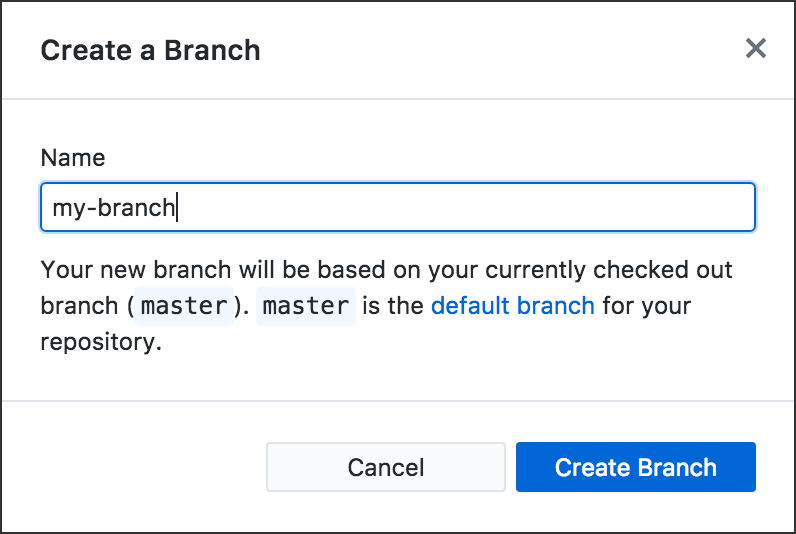
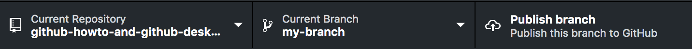
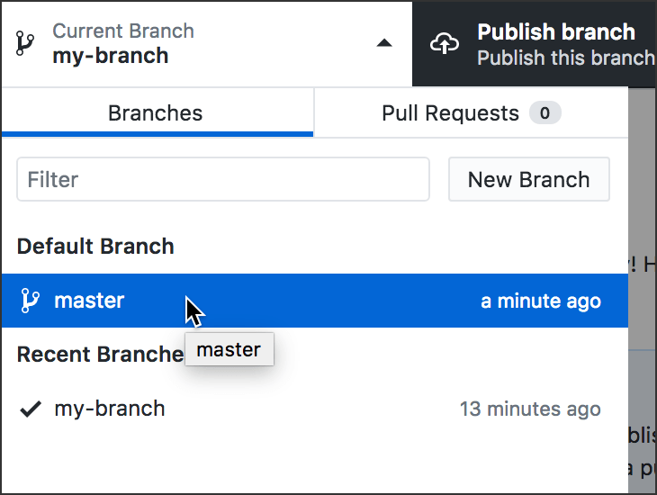
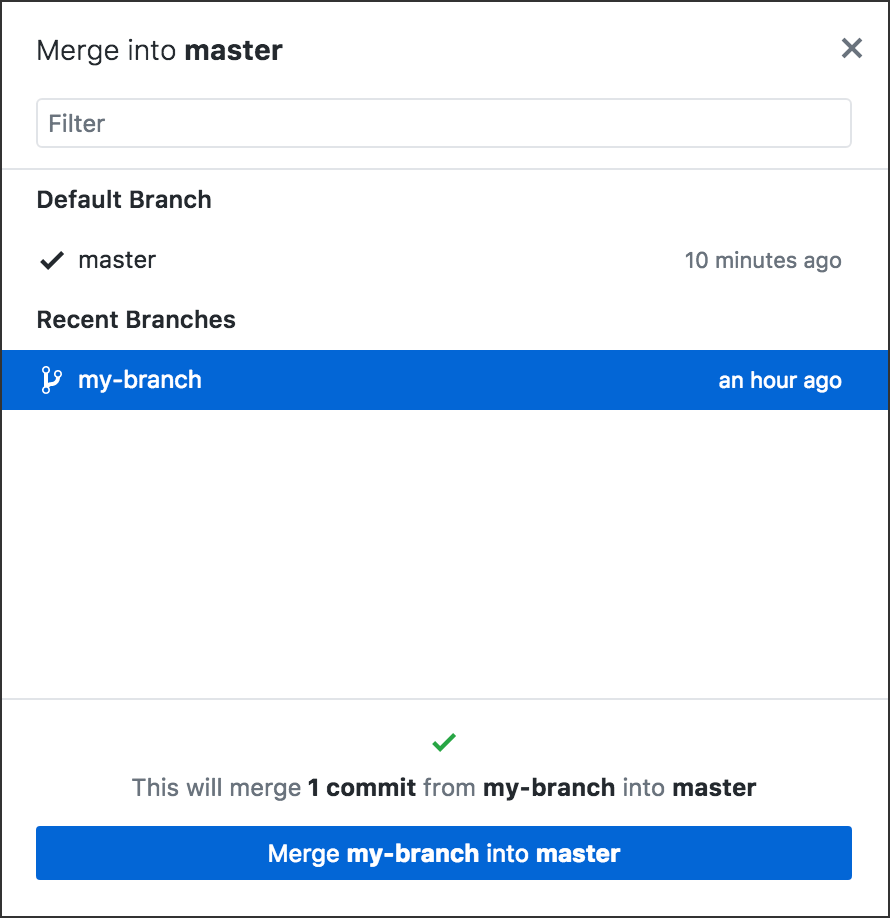

# Git Branches

Previous: [Publish or Push: Git Commit and Sync](../git_commit_and_sync)

Now you’re going to do something rather sophisticated in your GitHub app.

You’re going to create a new **branch.** This will enable you to make changes and even create new files *without affecting any of the original files* in your repo.

Why would you want to do that? The usual reason: You want to create something new and get it working perfectly without risk to everything else in your repo.

Teams of people working together to build software or large websites will use branches to isolate one feature (one part of the project) from the others, so that everyone on the team can develop separate parts of the project all at the same time. No one is waiting for anyone else to finish. No one will hurt anyone else’s work.

How do they put it all together then? They **merge** each branch into the *master* branch, one branch at a time.

## Hands-on: Find out how a branch works

This will only take a few minutes. Use any GitHub repo you already have on your computer. Make sure the repo has at least one file in it. Make sure everything is committed.

Open the repo folder in your Finder or File Explorer on your computer. You should see only the files inside the repo.

### 1. Create a new branch in the app

In the black bar at the top of your GitHub Desktop app, the middle button is the “Branch” button. It says “Current Branch” and (right now) *master*.

Click it to open the Branches list. You only have one branch, *master*. It has a check mark to show it’s the branch you’re in now.

Click the “New Branch” button.

Create a new branch named *my-branch*:

Notice what happened to the middle button, “Current Branch”:

You should also notice that the third button now says “Publish branch” and not “Push origin” or “Fetch origin.” (We *won’t* publish this branch to GitHub, though.)

### 2. Create a new file inside the new branch

1. Using Atom (or any text editor), create a new empty file **inside your repo** and save it **inside your repo**. Name it something that stands out, like FOOBAR.

2. Take a look at your Finder or File Explorer, at the window containing your repo files. You should see FOOBAR there, as you would expect.

3. In your GitHub Desktop app, *commit* FOOBAR.

### 3. Change branches in the app

1. Click the “Current Branch” button to open the Branches list.

2. Click *master* in that list.

3. Notice the middle button, “Current Branch” &mdash; now it says *master*.

4. Look at your Finder or File Explorer, at the window containing your repo files. FOOBAR is not there!

5. Use the Branches list to change branches *again.* Look at your Finder or File Explorer. FOOBAR is back!

How to change branches:

*Above: Changing from one branch to another in the app.*

The important thing to grasp is that git branches are *completely independent of one another.* The app is really handy in letting you see *at a glance* which branch you are in &mdash; just look at the “Current Branch” button.

**Note:** When you are in the *master* branch, the new file is not only missing from your Finder or File Explorer &mdash; it’s also missing from Atom. It’s not available *anywhere* unless you’re in the branch where it exists.

### 4. Merge a branch into *master*

Let’s imagine FOOBAR is a very important part of your project, so you want to add it to the *master* branch.

1. Make sure the “Current Branch” button says *master*.

2. Open the Branch **menu** at the top of the app &mdash; where the menus are File, Edit, View, Repository, Branch, and Help.

3. Select “Merge into Current Branch ...”

4. In the popup, select the branch you want to merge into *master*, and then click the button at the bottom.

...

## See branches in the GitHub app

First find the Branch button near the top left of the app window. THE APP. Not the website. THE APP. The Branch button has the **branch icon**:

To the right of the Branch icon is the name of the current branch. Right now, that is *master.* The first branch of a repo is always named *master* by default.

When you click the button that says *master,* you'll see a list of all the branches in this repo. Even now, *master* has a checkmark to show you it is the current branch — the one you are in now. You have only one branch so far.

## Create a new branch

In your GitHub app, click the button with the **branch icon.** You will see a field into which you can type the name of a new branch.

Type the word *assignment* and a hyphen and your own last name. For example:

*assignment-mcadams*

Click the “Create New Branch” button. A small box pops up; click “Create Branch” there. Yes, it’s redundant.

You should see your new second branch immediately.

Stay in this branch! DO NOT change it.

## What is the branch?

Your new branch is a perfect copy of all the files in *master.* Everything in *master* now exists as a copy in your *assignment* branch.

Branches are like parallel universes. What happens in one branch has no effect on any other branches.

The “parallel universes” analogy is really appropriate, because when you are in branch A, *you cannot see any of the files in branch B,* even though they are all local files on your hard drive. There is no chance of polluting any other branch.

Here's a specific example. If you created a new folder named *foo* in your *assignment* branch, and then switched to your *master* branch, you would not see the *foo* folder anymore. It would be gone, because it exists only in your *assignment* branch. If you switched back to your *assignment* branch, you would have access to the *foo* folder and all its contents again.

## Why do we work in a branch?

When teams collaborate, each person is working on a separate piece of the project. By doing all my work in a branch, I can eventually upload my work to the project and not interfere with your work in your own branch.

There's more to it, but let's leave it there for now.

Not everyone who uses GitHub uses or understands branches. However, branches are a standard part of
[GitHub Flow](https://guides.github.com/introduction/flow/), which many coding teams use as a normal part of their work.

## Switching between branches

This can be tricky, so pay attention. Remember the idea of “parallel universes”? Keep that in mind, because branches are NOT like folders. You can't simply move stuff back and forth between them. But *you* can change branches.

If you wanted to switch to another branch, you would simply use the menu/button. It used to say *master,* but now it says *assignment-yourname.* The current branch has the checkmark.

**DANGER!** If you make changes in one branch, and then you switch to another branch and make more changes, you will have a problem. Please be careful to stay inside the *assignment-yourname* branch AT ALL TIMES for the rest of this assignment.

## Your assignment

For this assignment, I want you to do EVERYTHING in your *assignment-yourname* branch. Do not make any edits or other changes while you are in *master.*

If you’re NOT in *assignment-yourname* now, **switch to it** and then **stay in it.**

This will allow you to do a pull request successfully, later. (We’ll do it in class.)

## Next steps

To continue with your assignment, go back to the top of this repo, where all files and folders are listed. Go into the folder named *assignment* and follow the instructions there. This is where you’ll create new files.

Remember to stay in your *assignment-yourname* branch! Do not switch branches again.
