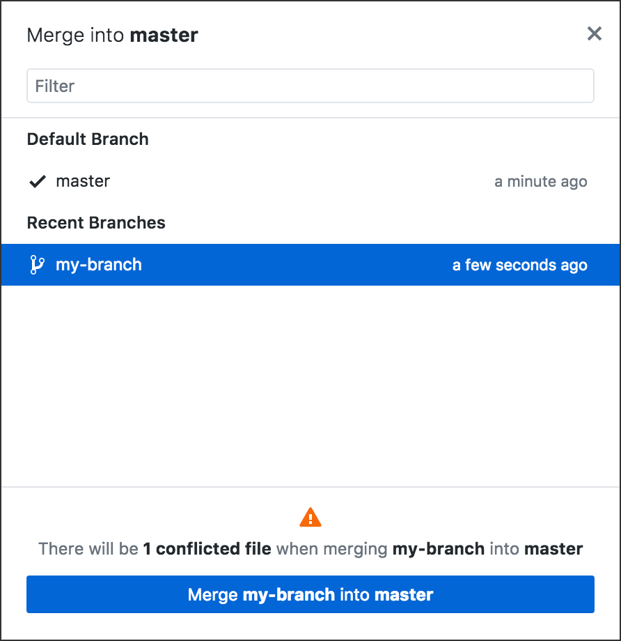
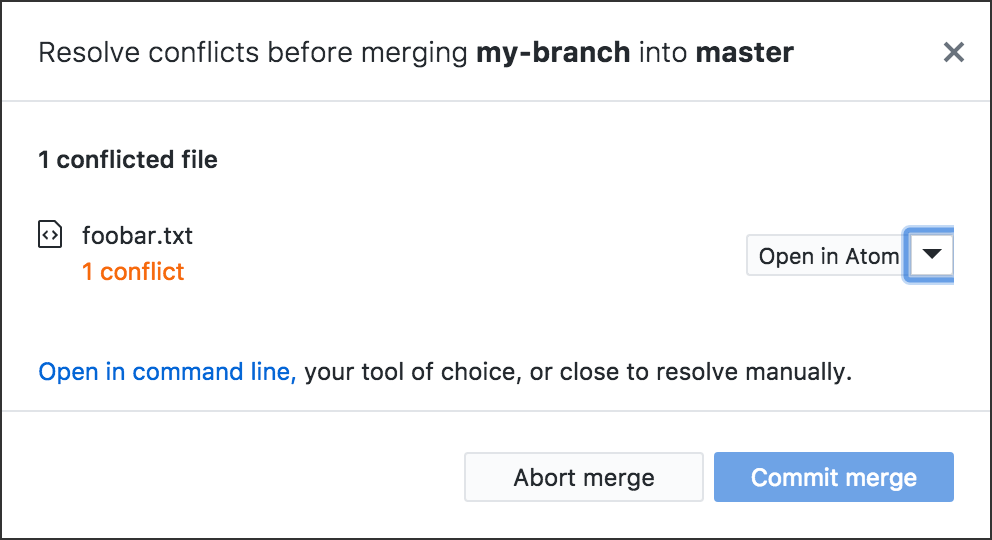
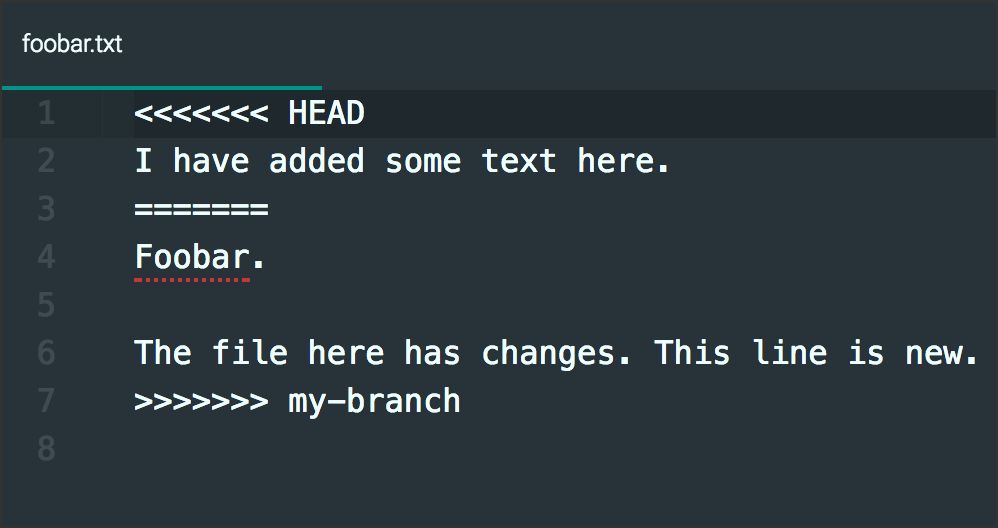
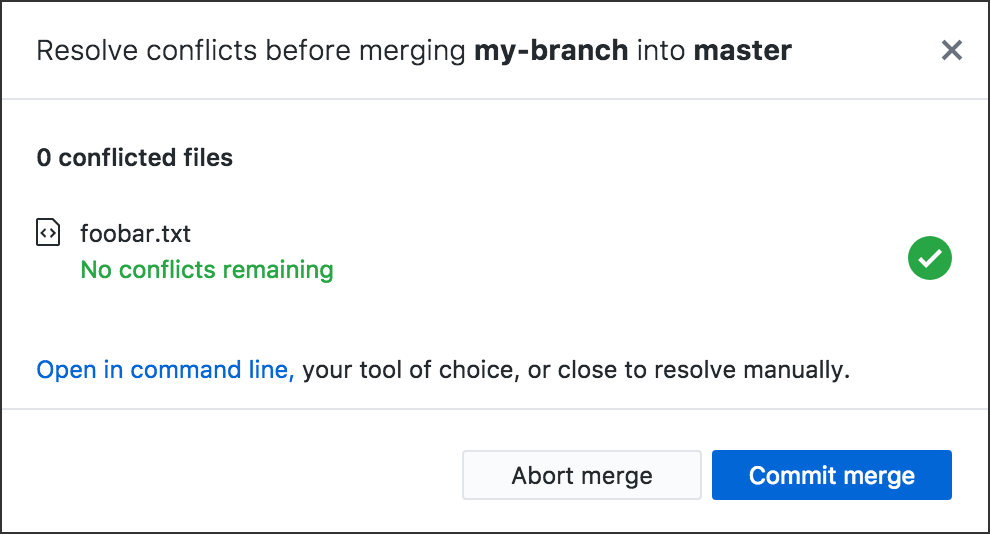

# Git Branches

Previous: [Publish or Push: Git Commit and Sync](../git_commit_and_sync)

Now you’re going to do something rather sophisticated in your GitHub app.

You’re going to create a new **branch.** This will enable you to make changes and even create new files *without affecting any of the original files* in your repo.

Why would you want to do that? The usual reason: You want to create something new and get it working perfectly without risk to everything else in your repo.

Teams of people working together to build software or large websites will use branches to isolate one feature (one part of the project) from the others, so that everyone on the team can develop separate parts of the project all at the same time. No one is waiting for anyone else to finish. No one will hurt anyone else’s work.

How do they put it all together then? They **merge** each branch into the *master* branch, one branch at a time.

## Hands-on: Find out how a branch works

This will only take a few minutes. Use any GitHub repo you already have on your computer. Make sure the repo has at least one file in it. Make sure everything is committed.

Open the repo folder in your Finder or File Explorer on your computer. You should see only the files inside the repo.

### 1. Create a new branch in the app

In the black bar at the top of your GitHub Desktop app, the middle button is the “Branch” button. It says “Current Branch” and (right now) *master*.

Click it to open the Branches list. You only have one branch, *master*. It has a check mark to show it’s the branch you’re in now.

Click the “New Branch” button.

Create a new branch named *my-branch*:

Notice what happened to the middle button, “Current Branch”:

You should also notice that the third button now says “Publish branch” and not “Push origin” or “Fetch origin.” (We *won’t* publish this branch to GitHub, though.)

### 2. Create a new file inside the new branch

1. Using Atom (or any text editor), create a new empty file **inside your repo** and save it **inside your repo**. Name it something that stands out, like FOOBAR.

2. Take a look at your Finder or File Explorer, at the window containing your repo files. You should see FOOBAR there, as you would expect.

3. In your GitHub Desktop app, *commit* FOOBAR.

### 3. Change branches in the app

1. Click the “Current Branch” button to open the Branches list.

2. Click *master* in that list.

3. Notice the middle button, “Current Branch” &mdash; now it says *master*.

4. Look at your Finder or File Explorer, at the window containing your repo files. FOOBAR is not there!

5. Use the Branches list to change branches *again.* Look at your Finder or File Explorer. FOOBAR is back!

How to change branches:

*Above: Changing from one branch to another in the app.*

The important thing to grasp is that git branches are *completely independent of one another.* The app is really handy in letting you see *at a glance* which branch you are in &mdash; just look at the “Current Branch” button.

**Note:** When you are in the *master* branch, the new file is not only missing from your Finder or File Explorer &mdash; it’s also missing from Atom. It’s not available *anywhere* unless you’re in the branch where it exists.

### 4. Merge a branch into *master*

Let’s imagine FOOBAR is a very important part of your project, so you want to add it to the *master* branch.

1. Make sure the “Current Branch” button says *master*.

2. Open the Branch **menu** at the top of the app &mdash; where the menus are File, Edit, View, Repository, Branch, and Help.

3. Select “Merge into Current Branch ...”

4. In the popup, select the branch you want to merge into *master*, and then click the button at the bottom.

Now FOOBAR is also in your *master* branch!

## Avoiding merge conflicts

When you have more than one branch in a repo, you might accidentally make changes in the wrong branch.

For example, now that you have *merged* FOOBAR into your *master* branch, you should not make changes to FOOBAR in the other branch.

A *merge conflict* occurs when you try to merge and you’re not merely adding new stuff to *master*. As an example, imagine you wrote some new text into *master*:FOOBAR, and then you changed to the other branch and wrote some other text in that branch’s FOOBAR. The following images show you how to *resolve the merge conflict* using the GitHub Desktop app and Atom.

*Above: You try to merge, but there is a conflict. Click the button at the bottom of the dialog above.*

*Above: You need to open the file in Atom, or your default editor. Click the menu that says “Open in Atom” and select default editor.*

*Above: This is git’s attempt to merge two conflicting files. Lines 1, 3, and 7 are inserted by git to indicate the file's contents in the two versions. Delete those three lines, edit as needed, and save the file.*

*Above: Everything’s fine. Just click the button.*

Branches are a standard part of
[GitHub Flow](https://guides.github.com/introduction/flow/), which many coding teams use as a normal part of their work.
