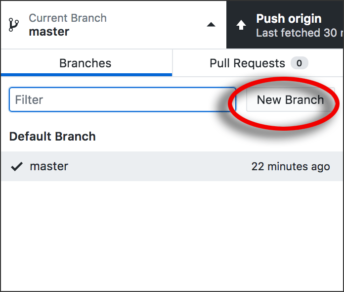

# Git Branches

Now you're going to do something rather sophisticated in your GitHub app.

You're going to create a new **branch.** This will enable you to make changes and even create new files without affecting any of the original files in your repo.

More important, by working only in a branch, later you will be able to make a **pull request** to the original repo. *This can only be done from a branch.* If the owner of the original repo allows it, your branch can then be **merged** into that original, incorporating your changes and new files into it. This is how thousands of people collaborate and contribute to [open-source](https://opensource.com/resources/what-open-source) projects.

Before you create a branch, make sure you have done everything [here](../github_basics) and [here](../README.md). Don't skip anything.

## See branches in the GitHub app

First find the Branch button near the top left of the app window. THE APP. Not the website. THE APP. The Branch button has the **branch icon**:

To the right of the Branch icon is the name of the current branch. Right now, that is *master.* The first branch of a repo is always named *master* by default.

When you click the button that says *master,* you'll see a list of all the branches in this repo. Even now, *master* has a checkmark to show you it is the current branch — the one you are in now. You have only one branch so far.

## Create a new branch

In your GitHub app, click the button with the **branch icon.** You will see a field into which you can type the name of a new branch.

Type the word *assignment* and a hyphen and your own last name. For example:

*assignment-mcadams*

Click the “Create New Branch” button. A small box pops up; click “Create Branch” there. Yes, it’s redundant.

You should see your new second branch immediately.

Stay in this branch! DO NOT change it.

## What is the branch?

Your new branch is a perfect copy of all the files in *master.* Everything in *master* now exists as a copy in your *assignment* branch.

Branches are like parallel universes. What happens in one branch has no effect on any other branches.

The “parallel universes” analogy is really appropriate, because when you are in branch A, *you cannot see any of the files in branch B,* even though they are all local files on your hard drive. There is no chance of polluting any other branch.

Here's a specific example. If you created a new folder named *foo* in your *assignment* branch, and then switched to your *master* branch, you would not see the *foo* folder anymore. It would be gone, because it exists only in your *assignment* branch. If you switched back to your *assignment* branch, you would have access to the *foo* folder and all its contents again.

## Why do we work in a branch?

When teams collaborate, each person is working on a separate piece of the project. By doing all my work in a branch, I can eventually upload my work to the project and not interfere with your work in your own branch.

There's more to it, but let's leave it there for now.

Not everyone who uses GitHub uses or understands branches. However, branches are a standard part of
[GitHub Flow](https://guides.github.com/introduction/flow/), which many coding teams use as a normal part of their work.

## Switching between branches

This can be tricky, so pay attention. Remember the idea of “parallel universes”? Keep that in mind, because branches are NOT like folders. You can't simply move stuff back and forth between them. But *you* can change branches.

If you wanted to switch to another branch, you would simply use the menu/button. It used to say *master,* but now it says *assignment-yourname.* The current branch has the checkmark.

**DANGER!** If you make changes in one branch, and then you switch to another branch and make more changes, you will have a problem. Please be careful to stay inside the *assignment-yourname* branch AT ALL TIMES for the rest of this assignment.

## Your assignment

For this assignment, I want you to do EVERYTHING in your *assignment-yourname* branch. Do not make any edits or other changes while you are in *master.*

If you’re NOT in *assignment-yourname* now, **switch to it** and then **stay in it.**

This will allow you to do a pull request successfully, later. (We’ll do it in class.)

## Next steps

To continue with your assignment, go back to the top of this repo, where all files and folders are listed. Go into the folder named *assignment* and follow the instructions there. This is where you’ll create new files.

Remember to stay in your *assignment-yourname* branch! Do not switch branches again.
