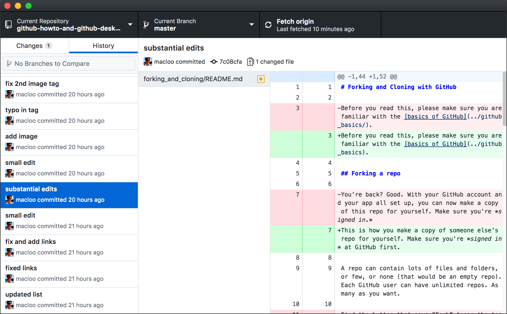
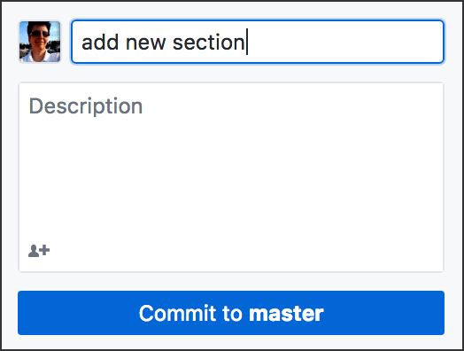

# Publish or Push: Git Commit and Sync

Previous:

* [GitHub Basics](../github_basics) &mdash; includes downloading **GitHub Desktop**
* [Your First Repo](../start_a_new_repo) (Start a New Repo)

You may *publish* or *push* files to a GitHub repo at any time. You can push again and again as you develop a project and add new files to it, or when you edit or delete files.

Each time you push, your new changes are noted and stored. Your previous versions of all files are still accessible to you. You can go back and view a previous version of any file.

Git (and GitHub) is a *version control* system.

## Commits, and commit messages

Before you can synchronize your local files (local repo) with GitHub (remote repo), you must **commit** your changes. Git requires this.

A commit is often described as a snapshot. The snapshot records what has changed in this project since your last commit. The list of all commits is a record of all the changes made to the project since it began.

The **commit message** is your description or explanation of those changes. These messages can be very helpful in collaborative projects. They might be less meaningful for small, solo projects &mdash; but you have to write them anyway.

You can view all commits in a project (shown below in the GitHub Desktop app) and even revert to a previous version. The **History** tab in the app reveals your past commits.

*Above: Open the History tab in the app to see a list of all your commits (left). Click any commit to see what you changed that time (right). Old is red, new is green.*

## How to commit

A good commit message might be: “Fixed broken links in all files,” or “Completed assignment.” Just indicate what your latest changes were.

With the **Changes** tab in the app selected, at bottom left you’ll see where to type your commit message. Below that, you don’t need a description. Below the description box is the commit button, which usually says “Commit to master.” **Note:** *master* is the name of the branch you are in. You might have other branches besides *master* &mdash; if you don’t, don’t worry about it.

**If you change anything** in your files after this, you will need to commit again. Same procedure, but you should write a different message, such as “fixed color error” — describe what you changed.

## Don’t forget to push &mdash; this syncs remote and local

Do this **after you commit.** You can make many commits, or one, before you push. In other words, *you do not need to push every time you commit.*

In the app, you’ll see the “Push origin” button at top right whenever you have committed changes. To push your changes up to GitHub.com, click the button. If the button says “Fetch origin,” you have no committed changes.

COMMIT, then PUSH.

**Note:** If you have not published this branch yet, the button will say “Publish,” not “Push origin.” Click that.

By pushing, you make your remote repo (at GitHub) match your local repo (on your hard drive), providing a backup for your work. By keeping local and remote repos synchronized, you can protect your work and also share it with other people.

Look at your repo on **github.com** and check to see that your files are there.

Next: [Git Branches](../git_branches)
