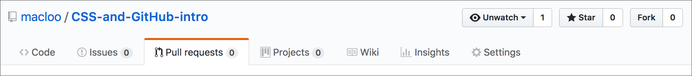

# Git Pull Requests

**This section is no longer part of the assignment.**

Before following these instructions, make sure all files are committed and sync'd.

Up to now, you have done the following:

1. [Created a GitHub account and signed in.](../github_basics)
2. [Forked and cloned a repo.](../README.md)
3. [Created a new branch named *assignment-yourname* and switched to that branch.](../git_branches)
4. [Completed the assignment about CSS styles.](../assignment)
5. [Committed and sync'd all changes. Published branch.](../git_commit_and_sync)

This is the last step!

## What is a pull request?

A pull request is your way to say, “My stuff is finished now. Please upload it to the main project or site.”

We use pull requests when the main project or site is controlled by someone else, and we are contributors to that site (or wannabe contributors). The `git pull` command can also be used to transfer files to a live Web server, but that's a task for another day.

So make sure *your stuff* is completely finished and fully functional before you submit a pull request!

## How to make a pull request on GitHub

Note that you will do this on GitHub, in **your own repo.** NOT in the original that you forked.

This is the pull request icon:

1. Open your remote repo on GitHub. The URL will resemble this: `github.com/yourname/CSS-and-GitHub-intro`
2. Switch into your *assignment-yourname* branch. On the left side, several lines below the top, you should see a gray button that says “Branch: master.” Click the gray button to switch branches. No *assignment-yourname* branch? Did you [commit and sync all changes](../git_commit_and_sync)?
3. Just below the gray button, you’ll see the current status of the branch. It should say something like “This branch is 6 commits ahead ...” or possibly “This branch is 2 commits ahead, 18 commits behind ...” The one thing it should NOT say is “This branch is even with ...” because that would mean you have not committed anything! (What is this *ahead, behind* stuff? It compares your repo with the original repo — the repo you forked, way back at the beginning. Your repo and that original repo are tethered to each other through the magic of Git!)
4. To the right of the gray Branch button, you’ll see another gray button that says “New pull request.” Click that and start the pull request process.
5. Now you are on the “Open a pull request” page, which has a form for you to fill in. Do so, then click the green button below the form that says “Create pull request.”

The **title** is the name of your request (what are you asking to add or change? Example: *Add new files*), and the **comment** (optional) gives the reason why.

## What might happen after making a pull request?

The owner of the original repo (the one you forked) might decide to **merge** your changes into the *master* branch of the original. In that case, your files and changes will appear in the original repo on GitHub!

Alternatively, the owner might want to discuss your changes with you. In that case, a message would be visible to you [here](https://github.com/macloo/CSS-and-GitHub-intro/pulls) (in the case of this assignment).

To see all pull requests in a repo, and the conversations about them, find the "Pull requests" tab near the top of the repo and go there.

## Conclusion

If you have successfully completed all the steps, **your instructor will see your pull request and approve it,** and your new files will be added to the original repo.

It should be clear to you now why you had to rename the two files: If your filenames were identical to the names of the original files, yours would overwrite the originals. Moreover, there would be no way to add the files of ALL the students in the class.

Everyone admits it is a challenge to learn Git and GitHub. Everyone goes through the same challenging process to learn how to use them.

**We will continue using these tools in this course** because they are powerful and widely used for all kinds of professional sites, apps, businesses and projects.
