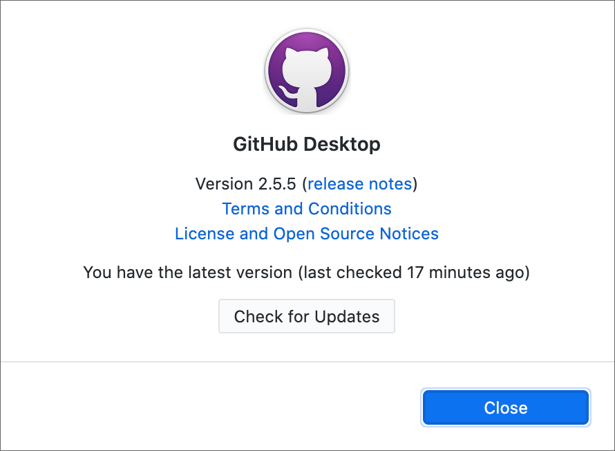

# GitHub Basics

These are instructions for getting started with GitHub.

To learn why GitHub is important, you can read:

* [What Exactly Is GitHub Anyway?](https://techcrunch.com/2012/07/14/what-exactly-is-github-anyway/) (2012)
* [How GitHub Conquered Google, Microsoft, and Everyone Else](http://www.wired.com/2015/03/github-conquered-google-microsoft-everyone-else/) (2015)
* [GitHub Is Microsoft’s $7.5 Billion Undo Button](https://www.bloomberg.com/news/articles/2018-06-06/github-is-microsoft-s-7-5-billion-undo-button) (2018)

If you’re not interested in why GitHub is important, then don’t read them.

## What is a repo?

Right now you’re looking at a GitHub repo. “Repo” is short for “repository.” A repo is a place to store code. More important, it is a place to keep a record of all your changes. It’s also great for sharing and collaborating.

This repo is named “github-howto-and-github-desktop.” The name of any repo is at the top of the web page. When you’re inside a repo, click its name to return to the top of the repo.

A repo usually contains several folders and files. Some repos contain dozens of folders and files &mdash; maybe even hundreds.

## Sign up for GitHub

So you can play too, you need to get a GitHub account (if you don’t have one yet). There should be a “Sign Up” link in the top right corner of this page (if you are not already signed in).

If you already have a GitHub account, use that one.

**Note:** Think about your username before you choose it. This is a professional space. Your username will be visible to strangers. Many people use their real first and last names. A short username is good.

GitHub is free unless you want some [special features](https://github.com/pricing) for collaboration. You will not need those for this class.

You can have only ONE GitHub account per email address.

A repo can be public or private. Your work for this course will all be public. Private repos used to be reserved for paid GitHub accounts, but now even free accounts get unlimited private repos.

A GitHub user has a profile and a list of links to all their public repos. These are mine (notice my username, **macloo**, in the URL):

* Profile: https://github.com/macloo
* Public repos: https://github.com/macloo?tab=repositories

## Download the GitHub Desktop app

Download [GitHub Desktop](https://desktop.github.com/). Also free. If you downloaded this app before now, check to make sure you have the *newest* version.

*On the GitHub Desktop menu (Mac) or the File menu (Windows), open “About GitHub Desktop” to check that you’ve got the latest version.*

I will refer to GitHub Desktop as “the app.” You will use the app to coordinate files in a project between your computer (local) and GitHub.com (remote).

Install the app. To see how, go to the Help section for the app: [Getting Started with GitHub Desktop](https://help.github.com/desktop/guides/getting-started-with-github-desktop/).

**IMPORTANT:** Using the same Help instructions as needed, LINK your GitHub account to the app. This is called “Authenticating to GitHub.” **Note:** You do not have 2FA or Enterprise.

You DID sign up for GitHub already &mdash; yes? This only works if you have a GitHub account.

## Get organized

Time for some thinking: GitHub expects things to be stable on your hard drive(s). That means you need to decide very deliberately WHERE on your hard drive a folder associated with GitHub will be. DO NOT associate GitHub with folders on your Desktop! Folders for your web projects should always be inside your Documents folder on your hard drive.

You can make a new folder for a GitHub project *inside* the folder you already have for this class. There’s no problem with that.

Your GitHub app is going to coordinate things for you between the web (GitHub) and your hard drive &mdash; but GitHub can’t think, and GitHub can’t figure out that you have moved a folder or changed its name. So plan ahead, and make a folder that will STAY PUT and KEEP THE SAME NAME.

## Next steps

**Go back to the top of this repo now.** To get back to the top of any repo, find the link with the repo’s name in the top left area of the web page (the page you are reading right now). Click the link!

Find the folder named *start_a_new_repo* and open it to read the *README* file there.

Or just [click this link](../start_a_new_repo/) to go there.
