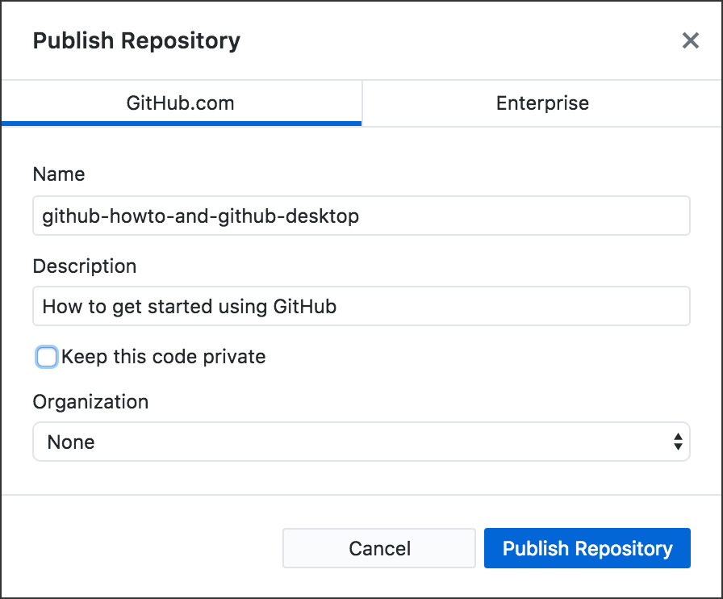
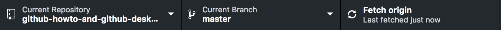

# Start a New Repo

This is the easiest way to start a repo from scratch, in my opinion. Note, this is a repo you are creating &mdash; you did NOT fork and clone.

Previous: [GitHub Basics](../github_basics/) &mdash; includes signing up and downloading **GitHub Desktop**

1. Create a new folder on your own computer. NOT on your Desktop. Create it *inside a folder* where similar work is always kept. If you’re doing coursework, then have a folder for your course, and create this new folder inside that one.

2. Name the folder as you would want the repo to be named. For example, this repo is named *github-howto-and-github-desktop* &mdash; and that is also the folder name on my computer. Note that GitHub repo names cannot have spaces or punctuation, other than hyphens.

3. Create one new file inside your new folder (for example, *index.html*). Save the file.

4. Open the GitHub Desktop app.

5. At top left inside the app window, click the black bar that says “Current Repository.” This opens a list of all your repos on the computer you are using. If you don’t have any repos yet, of course the list is empty.

6. From your Finder or File Explorer window, drag the folder you just made and drop it into the list in the GitHub Desktop app.

7. You’ll get a popup that says this does not appear to be a Git repository &mdash; and a link says: “create a repository” &mdash; click that link. The link. Not the button.

8. Then **a second window opens,** and you need to uncheck “Keep this code private.” Do not touch the Name. You may write a Description (optional). Be sure to click the “Publish Repository” button here. 

9. The GitHub Desktop app automatically **commits** all the files in a new repo, BUT **they have not been pushed to GitHub yet.**

10. To upload the file &mdash; and your new repo &mdash; you must click the black bar at top right inside the app window, which says: “Publish.” After publishing the first time, in the future this bar will say either “Push origin” or “Fetch origin.”

Now open [GitHub.com](https://github.com/) in your web browser. If you’re not signed in, sign in. Go to your repositories (there's a menu on the far right side), and you should see your new repo on your own Repositories page.

*There are three important buttons in the black bar at the top of the GitHub Desktop app.*

Next: [Publish or Push: Git Commit and Sync](../git_commit_and_sync/)
